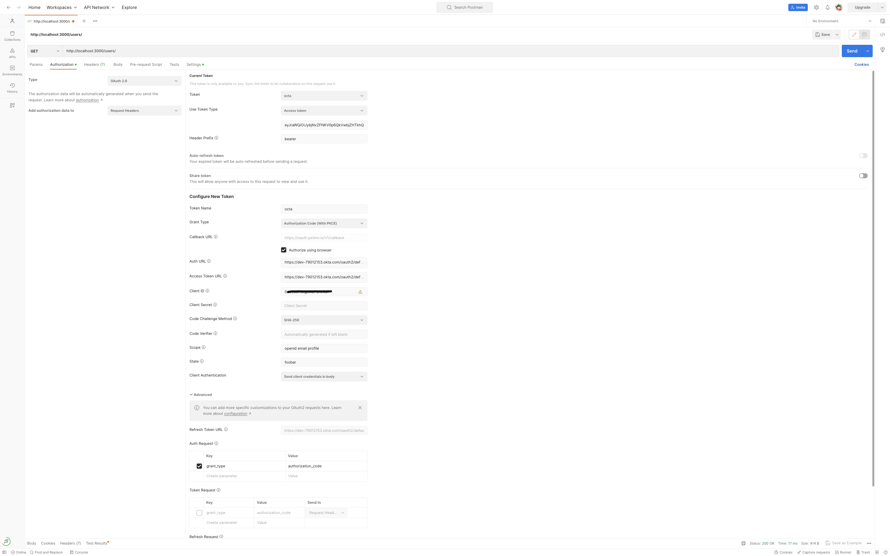

## Description

[Nest](https://github.com/nestjs/nest) framework TypeScript starter repository.

## Installation

```bash
$ npm install
```

## Running the app

```bash
# development
$ npm run start

# watch mode
$ npm run start:dev

# production mode
$ npm run start:prod
```

## Test

```bash
# unit tests
$ npm run test

# e2e tests
$ npm run test:e2e

# test coverage
$ npm run test:cov
```
## Swagger Api
http://localhost:3000/api#/


##Octa Authentication

1. Create octa account if you does not have 
2. Login 
3. Create Octa app : Applications--> Applications --> Create app Intergration


4. Go to Security --> API and see the default Autherization


5. Go to directory --> People 


6. Postman setting



7. Thunder clinet

